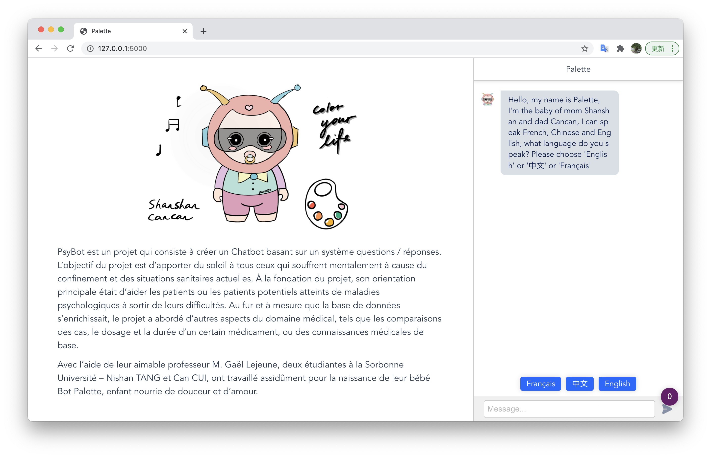
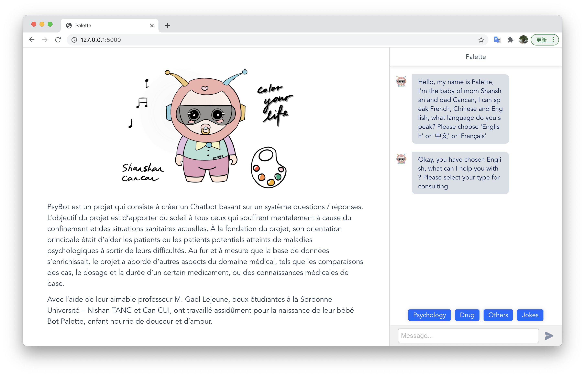
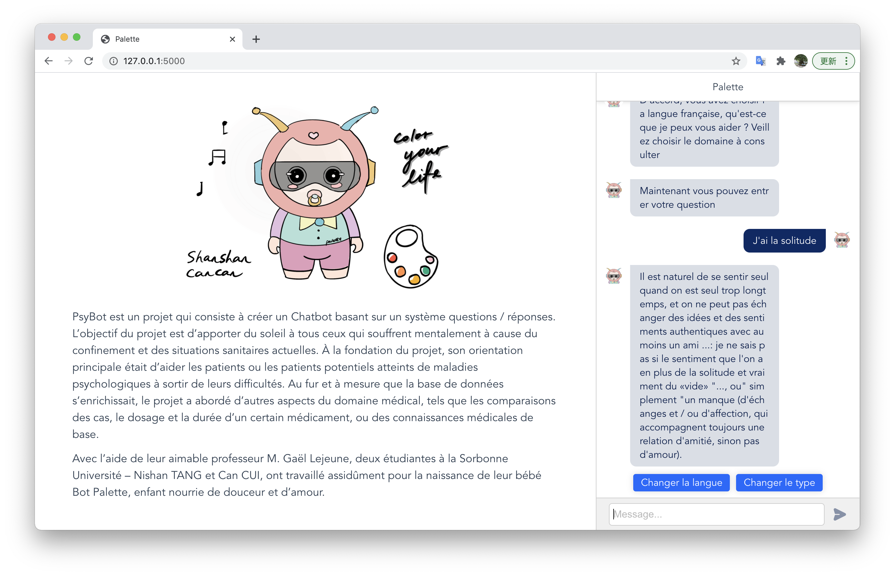
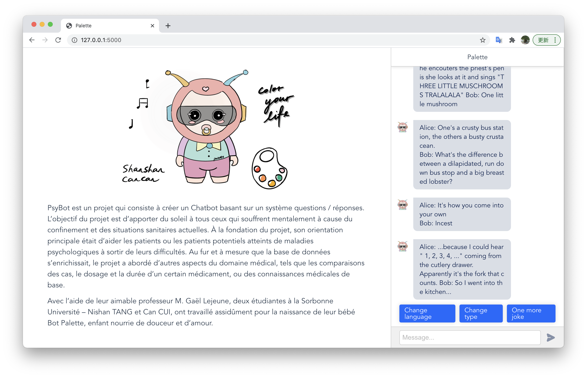
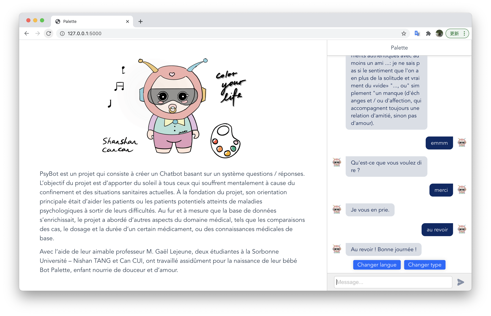

# Chatbot_Psycho

The project aims to create a chatbot for spiritual counseling. The project was created by Can Cui and Nishan Tang of the Sorbonne University. The goal is to bring light and hope to people who are suffering from mental illness or potential patients. Our baby robot is fed with love and sweat, and we hope you will treat it well.

## Example 1: welcom page - chose language

## Example 2: buttons for chosing type

## Example 3: communication page

## Example 4: joke page

## Example 5: some feedback special

# Explications

## Files

1. `data` Database
2. `model` Model training
3. `server` (back-end) Web server and application python code for chatbot
4. `train` some codes original for chatbot
5. `web` (front-end) Project web
6. `app.py` Run server

## How to run project of Front-end

1. install Node from [website official](https://nodejs.org/en/),please install version-LTS
2. cd to web
3. run`npm install`
4. wait for installing
5. run`npm run serve`
6. open your web browser with `http://localhost:8080`

## How to run the full project

1. cd to web
2. run `npm run build` to pack the front-end
3. cd to root with the command `cd ..` 
4. run server with command `python app.py` or `python3 app.py` for python3
5. open your web browser with `http://localhost:5000`
