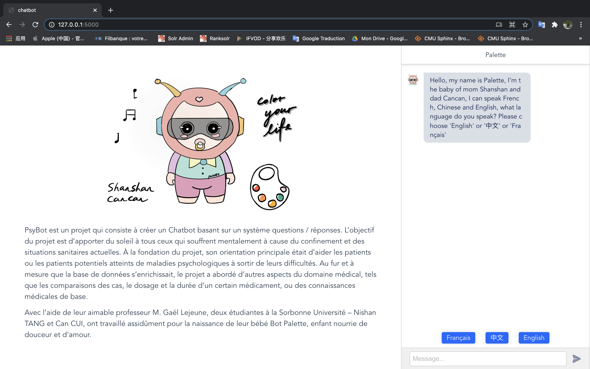
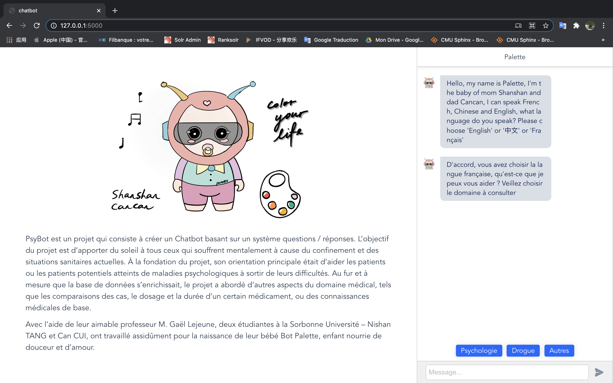
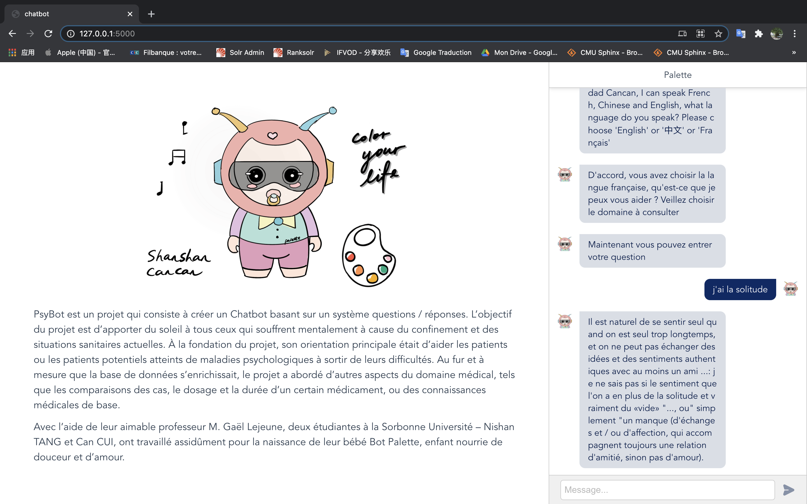
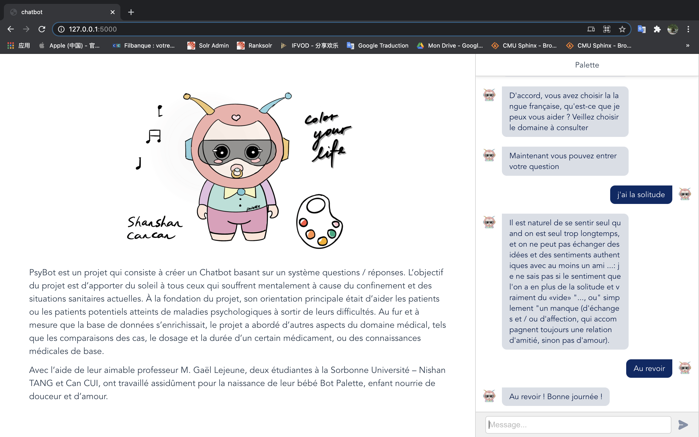

# Chatbot_Psycho

The project aims to create a chatbot for spiritual counseling. The project was created by Can Cui and Nishan Tang of the Sorbonne University. The goal is to bring light and hope to people who are suffering from mental illness or potential patients. Our baby robot is fed with love and sweat, and we hope you will treat it well.

## step 1 chose language

## step 2 chose type

## step 3 communication

## step 4 bye

## Explication
1. `data` Database
2. `model` Model training
3. `server`Web server and application python code
4. `train` Python code for chatbot
5. `web` Projet web
6. `app.py` Run server

## How to run Front-end

1. install Node from [website official](https://nodejs.org/en/),please install version-LTS
2. cd to web
3. run`npm install`
4. wait for installing
5. run`npm run serve`
6. open your web browser with `http://localhost:8080`

## How to run the full projet

1. cd to web
2. run `npm run build` to pack the front-end
3. cd to root with the command `cd ..` 
4. run server with command `python app.py` or `python3 app.py` for python3
5. open your web browser with `http://localhost:5000`
